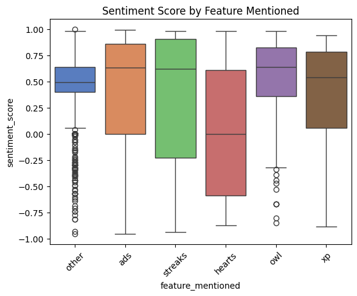
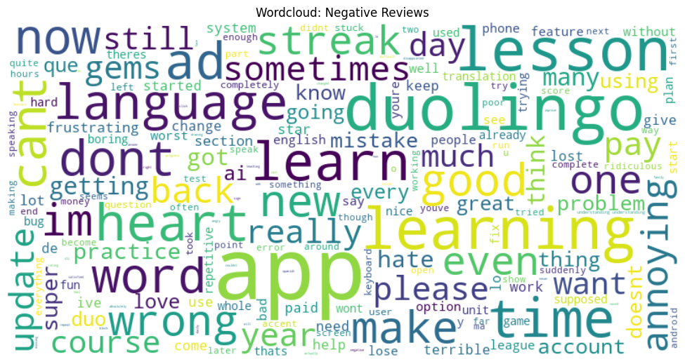
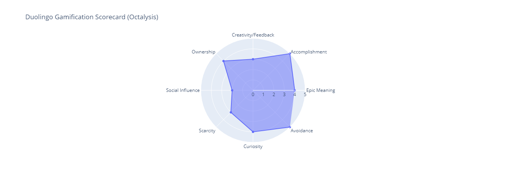
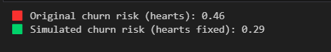

# 📊 Duolingo App Behavioral Analysis

This project analyzes 2,000+ real Duolingo app reviews from the Google Play Store to uncover user sentiment trends, product pain points, and opportunities for improvement. It combines NLP, sentiment scoring, churn risk modeling, and business strategy to simulate product fixes and recommend data-driven A/B tests.

---

## 🔍 Key Insights

- 💔 "Hearts" are the most negatively discussed feature (46% churn risk)
- 🛠 Simulated fix of hearts reduces churn risk to 29%
- 🔁 Wordcloud analysis reveals frustration around "hearts", "ads", and "streak loss"
- 🧪 Proposed A/B test to validate product strategy changes
- 🧠 Created a gamification scorecard using the Octalysis framework

---

## ⚙️ Tools & Techniques

- **Languages**: Python
- **Libraries**: pandas, seaborn, matplotlib, plotly, scikit-learn, nltk, prophet, streamlit
- **NLP**: VADER sentiment analysis, wordclouds, regex cleaning
- **ML**: Logistic Regression to model churn risk
- **Forecasting**: Prophet to model sentiment trends
- **Strategy**: A/B test planning, Octalysis Framework for product gamification

---

## 📁 Project Structure

```
0_data/
├── raw/            # Scraped reviews
├── cleaned/        # Preprocessed and tagged reviews
└── exports/        # Final datasets with churn risk + simulations

1_notebooks/        # EDA + modeling notebooks
2_src/              # Python scripts (scraper, sentiment, tagging)
3_reports/          # Optional PDF slide deck
4_app/              # Streamlit dashboard (optional)
visuals/            # All graphs and wordclouds
```

---

## 📷 Visual Highlights

### Sentiment by Feature


### Wordcloud: Negative Reviews


### Gamification Scorecard (Octalysis)


### Simulated Churn Improvement (Hearts Fix)


---

## 🧪 A/B Test Recommendation

| Group      | Experience               | Metric                   |
|------------|--------------------------|--------------------------|
| Control    | Standard hearts system   | Churn rate, sentiment    |
| Variant    | Unlimited/relaxed hearts | Churn ↓, sentiment ↑     |

> 📉 **Simulated churn drop: 46% → 29%** if hearts were improved

---

## 💡 How to Run This Project

1. Clone this repository:
```bash
git clone https://github.com/shikha-punjabi/duolingo-analysis.git
```

2. Set up your environment and install dependencies:
```bash
pip install -r requirements.txt
```

3. Run notebooks:
```bash
cd 1_notebooks/
jupyter notebook
```

4. (Optional) Launch the Streamlit dashboard:
```bash
streamlit run 4_app/streamlit_app.py
```

---

## 🚀 Author

**[Shikha Punjabi]** – Master's in Data Science  
Built as a flagship portfolio project for Data Analyst & Business and Product Analyst roles  
🔗 [LinkedIn](https://www.linkedin.com/in/shikha-punjabi/)
